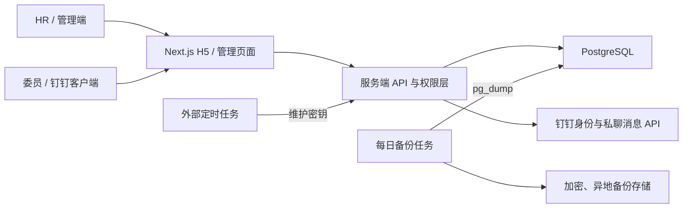

# 架构与数据边界

## 1. 设计目标

系统采用“钉钉作为身份和消息入口，自有服务作为投票事实源”的方式。钉钉群聊只负责引导进入 H5；最终票、修改历史、名单快照、审计日志和统计均以 PostgreSQL 为准。



核心信任边界：

1. 浏览器中的身份、角色、投票状态和收件人列表都不可信，必须由服务端会话与数据库重新确认。
2. 委员只能读取自己的投票状态和可见投票元数据；投票期间不能获得汇总、明细或他人意见。
3. HR 可看进度、统计和记名明细，但每次查看敏感明细、导出、催票、关闭均应记录审计日志。
4. 钉钉临时授权码只用于服务端换取身份，不写入日志和数据库。

## 2. 角色和可见性

| 能力 | HR | 本场委员 | 其他登录用户 |
| --- | --- | --- | --- |
| 发起投票、设置候选人/截止时间 | 是 | 否 | 否 |
| 查看已投/应投与未投名单 | 是 | 仅自己的提交状态 | 否 |
| 查看实时票数和比例 | 是 | 否（投票期间及关闭后默认仍不开放） | 否 |
| 查看记名选择和意见 | 是 | 仅自己的当前票及历史（如产品开放） | 否 |
| 提交/修改投票 | 否 | 截止且关闭前 | 否 |
| 私聊提醒未投委员 | 是 | 否 | 否 |
| 未全员时手动关闭 | 是 | 否 | 否 |
| 导出 | 是 | 否 | 否 |

“发起人”和“HR”在 MVP 中是同一授权角色。若以后增加多个 HR，权限应由服务端角色表或组织授权范围管理，不能依赖姓名或前端常量。

## 3. 领域模型

实际表名以迁移文件为准，至少需要表达以下实体和约束：

### Poll（投票场次）

- `id`
- `title`
- `candidate_name`：结构化人选姓名，必填、可检索
- `committee_type`：学术委员会/技术委员会
- `status`：OPEN/CLOSED
- `deadline_at`：带时区时间戳
- `created_by`、`created_at`
- `closed_by`、`closed_at`、`close_reason`（MANUAL/AUTOMATIC）

每场只允许一个 `candidate_name`。不在数据库中存储“自动通过/未通过”结论，因为当前规则仅做统计。

### PollVoter（场次委员快照）

- `poll_id`
- `dingtalk_user_id`（或系统内部用户外键）
- 投票发起时的姓名、部门/委员会信息快照

发起时固化名单。以后委员会人员调整不能改写历史场次的应投人数。

### VoteCurrent（当前有效票）

- `poll_id`
- `voter_id`
- `choice`：APPROVE/REJECT/ABSTAIN
- `opinion`
- `version`
- `submitted_at`、`updated_at`

数据库必须有 `(poll_id, voter_id)` 唯一约束。APPROVE/REJECT 的意见非空规则应在服务层强制校验，并尽可能再用数据库约束兜底。

### VoteRevision（投票修订历史）

- `vote_id`、`version`
- 修改前/后的选择与意见（或每版完整快照）
- `changed_by`、`changed_at`

投票更新必须在同一数据库事务中追加修订历史并更新当前票。历史表采用追加写，不提供常规删除/覆盖接口。

### AuditLog（审计日志）

记录登录结果、发起、首次投票、修改、关闭、催票、查看/导出敏感明细、定时关票和管理配置变更。建议包含操作者、动作、资源 ID、结果、时间、请求关联 ID 和最小必要的上下文；不要写入会话令牌、应用密钥或完整意见正文。

## 4. 关键流程

### 钉钉免登

1. H5 在钉钉客户端内调用当前官方 JSAPI 获取一次性临时 `authCode`。
2. H5 `POST /api/auth/dingtalk`，JSON 为 `{ "authCode": "..." }`。
3. 服务端使用企业内部应用凭证向钉钉换取稳定用户标识，再从本地授权表判断 HR/委员身份。
4. 服务端签发 Secure、HttpOnly、SameSite 合适的短期会话 Cookie。

这不是浏览器保存 AppSecret 的 OAuth 流程。AppSecret 只能存在服务端。开放平台后台出现“回调地址/授权域名/安全域名”等字段时，应按租户当前控制台和官方文档填写，不能把示例域名照搬到生产。

### 提交或修改投票

服务端按顺序检查：有效会话 → 是本场名单成员 → 场次仍 OPEN → 当前时间早于截止时间 → 选项/意见规则 → 事务内写历史与当前票。不能仅根据客户端加载页面时看到的 OPEN 状态提交。

并发修改采用唯一约束加事务；建议使用 `version` 做乐观锁，避免两个页面相互覆盖而不留痕。

### 自动关闭

外部调度器每分钟调用：

```http
POST /api/internal/maintenance/close-expired
x-maintenance-secret: <MAINTENANCE_SECRET>
```

服务端用数据库时间查找 `deadline_at <= now()` 且仍 OPEN 的场次，幂等关闭并记录 `close_reason=AUTOMATIC`。即使调度器有短暂延迟，投票提交接口也必须独立拒绝截止后的票，不能依赖“状态字段已经及时改成 CLOSED”。

### 手动关闭

HR 可以在未全员投票时关闭。关闭动作必须二次确认、事务化、幂等，并保存操作者、时间和原因。关闭后任何委员都不能提交或修改。

### 一键催票

`POST /api/polls/:id/remind` 只接收投票 ID。服务端确认 HR 权限、场次状态，计算“名单快照 - 已投用户”，再逐人调用钉钉消息适配器。接口返回成功/失败人数和可追踪结果，但不向前端泄露钉钉令牌。

必须设置防重复点击/频率限制并记录每位收件人的发送结果。不得允许客户端提交任意钉钉用户 ID，否则会变成群发接口。

## 5. 统计口径

- 分母：当前已提交有效票数，不是应投人数；页面同时单独展示 `已投 / 应投`。
- 百分比：`该选项票数 / 已投票数`；已投为 0 时三个比例均显示 0%，避免除零。
- 当前票用于统计；历史修订不重复计票。
- 系统不根据票数生成“通过/未通过”结论。
- 导出需标注场次状态、候选人、截止/关闭时间、应投/已投/未投及统计口径。

## 6. 时间和幂等

- 数据库统一保存 UTC 带时区时间戳；界面按 `Asia/Shanghai` 展示。
- 发起接口建议支持幂等键，防止移动网络重试创建重复场次。
- 首次投票/修改、手动关闭、自动关闭、催票都必须能安全处理重复请求。
- 服务器、数据库和调度器需启用时间同步；验收时测试截止时刻边界。
